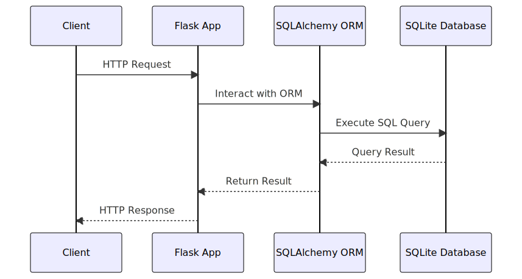

# Recipe Review Microservice

This repository contains the Recipe Review microservice, a part of a larger recipe sharing application. This microservice allows users to post reviews for recipes, update their reviews, view reviews for a particular recipe, and delete their reviews.

# Communication Contract
Requesting Data from the Microservice

Clients can interact with the microservice via HTTP requests. Here are the details for each endpoint:

    GET /api/reviews/{recipe_id}: Retrieves all reviews for a specific recipe. Replace {recipe_id} with the actual ID of the recipe you want to retrieve reviews for.

Example Call: GET http://localhost:5001/api/reviews/1

    POST /api/reviews: Creates a new review. The request body should be a JSON object with the following format:

    {
    "recipe_id": {recipe_id},
    "user_id": {user_id},
    "content": "{content}",
    "rating": {rating}
    }

Replace {recipe_id} and {user_id} with the actual IDs, {content} with the text of the review, and {rating} with the review rating (a number between 0 and 5).

Example Call: POST http://localhost:5001/api/reviews with the above JSON in the request body.

PUT /api/reviews/{review_id}: Updates an existing review. Replace {review_id} with the actual ID of the review you want to update. The request body should be a JSON object with the new content and/or rating:

    {
    "content": "{new_content}",
    "rating": {new_rating}
    }

Replace {new_content} with the new review text and {new_rating} with the new review rating.

Example Call: PUT http://localhost:5001/api/reviews/1 with the above JSON in the request body.

DELETE /api/reviews/{review_id}: Deletes an existing review. Replace {review_id} with the actual ID of the review you want to delete.

Example Call: DELETE http://localhost:5001/api/reviews/1
Receiving Data from the Microservice

The microservice responds with JSON data. For successful requests, the JSON includes the requested data or a confirmation message. For unsuccessful requests, the JSON includes an error message.

For example, a successful GET request to /api/reviews/1 would return:

    [
        {
            "id": 1,
            "recipe_id": 1,
            "user_id": 1,
            "content": "This recipe is great!",
            "rating": 4.5
        }
    ]

A successful POST request to /api/reviews would return:

    {
        "id": 2,
        "recipe_id": 1,
        "user_id": 1,
        "content": "This recipe is fantastic!",
        "rating": 5.0
    }

If a review with the provided ID doesn't exist, a DELETE request to /api/reviews/{review_id} would return:

    {
        "message": "Review not found",
        "error": "..."
    }

